# 🚀 Guia Definitivo: Desenvolvimento Enterprise
## Firebase Studio + Next.js + Cloudflare Workers  
**Versão: 3.0 - Outubro 2025**

**Objetivo:** Construir sistemas robustos, performáticos e seguros com redução de até 80% em leituras/escritas do Firebase usando Firebase Studio como ambiente de desenvolvimento principal

---

## 📚 Índice

1. [🗺️ Visão Geral da Arquitetura](#1-visão-geral)
2. [🚀 Stack Tecnológica Padrão](#2-stack)
3. [⚙️ Setup Inicial no Firebase Studio](#3-setup)
4. [📁 Estrutura de Pastas Otimizada](#4-estrutura)
5. [⚛️ Padrões de Código Next.js + Firebase](#5-nextjs)
6. [✨ Animações e UX com Framer Motion](#6-framer-motion)
7. [☁️ Arquitetura Edge (Cloudflare)](#7-cloudflare)
8. [⚡ Configuração de Cache e Durable Objects](#8-cache-durable-objects)
9. [🔥 Integração Firebase & Data Connect](#9-firebase)
10. [🔒 Segurança Avançada](#10-segurança)
11. [🧾 Validação e Formulários](#11-formularios)
12. [⚛️ Gerenciamento de Estado Global](#12-estado-global)
13. [🧪 Testes Automatizados](#13-testes)
14. [📊 Logging e Monitoramento](#14-logging)
15. [⚙️ Variáveis de Ambiente](#15-variaveis-ambiente)
16. [🚀 CI/CD & Deploy Firebase](#16-ci-cd)
17. [💅 Padronização de Código](#17-padronizacao)
18. [🛡️ Ferramentas de Segurança](#18-seguranca)
19. [⚡ Performance & Caching](#19-performance)
20. [📈 Auditoria e Observabilidade](#20-auditoria)
21. [🧾 Checklist Diário de Desenvolvimento](#21-checklist)
22. [🐞 Troubleshooting & Debugging](#22-troubleshooting)
23. [🔄 Guias de Migração](#23-migracao)
24. [📚 Glossário Essencial](#24-glossario)
25. [💰 Estimativas de Custos](#25-custos)
26. [🛣️ Roadmap de Evolução](#26-roadmap)
27. [🎯 Prioridades de Implementação](#27-prioridades)

---

## 1. 🗺️ Visão Geral da Arquitetura {#1-visão-geral}

### 1.1. Arquitetura Híbrida: Firebase Studio + Cloudflare

```mermaid
graph TB
    User[👤 Usuário] --> CF[🌐 Cloudflare Worker<br/>Edge Layer]
    
    CF --> Cache{Cache HIT?}
    Cache -->|SIM| Response[⚡ Resposta Rápida<br/>~10-50ms]
    Cache -->|NÃO| Firebase[🔥 Firebase Studio<br/>Core Layer]
    
    Firebase --> DataConnect[Data Connect GraphQL]
    Firebase --> Auth[Authentication]
    Firebase --> Firestore[Firestore Database]
    Firebase --> Hosting[App Hosting]
    
    CF --> RateLimit[Rate Limiting]
    CF --> JWT[JWT Validation]
    CF --> Transform[Data Transform]
    
    Studio[🛠️ Firebase Studio IDE] --> Firebase
    Studio --> CF
    
    style Firebase fill:#ff9800,stroke:#333
    style CF fill:#f96,stroke:#333
    style Cache fill:#4caf50,stroke:#333
    style Studio fill:#4285f4,stroke:#333
```



### 1.2. Princípios Fundamentais

- **Firebase Studio:** Ambiente de desenvolvimento unificado com IDE integrado
- **Data Connect:** Camada GraphQL tipada para operações de dados
- **Cloudflare Workers:** Gateway inteligente com cache e segurança
- **Firebase Hosting:** Deploy automatizado com CDN global
- **Redução de Custos:** 70-80% menos leituras via cache KV

### 1.3. Fluxo de Desenvolvimento no Firebase Studio

```typescript
// 1. Desenvolvimento no Firebase Studio IDE
Firebase Studio (VSCode integrado)
  ↓ [Desenvolvimento com IA assistente]
  ↓ [Prototipagem com Gemini]
  
// 2. Build e Deploy
Firebase CLI → Build Next.js
  ↓
Firebase App Hosting (Deploy automático)
  ↓
Cloudflare Workers (Configuração automática)

// 3. Runtime
Usuário → Cloudflare (Cache/Segurança) → Firebase Services
```

---

## 2. 🚀 Stack Tecnológica Padrão {#2-stack}

### 2.1. Dependências Core (Otimizadas para Firebase Studio)

```json
{
  "dependencies": {
    "next": "^15.0.0",
    "react": "^19.0.0",
    "typescript": "^5.5.0",

    "firebase": "^11.0.0",
    "firebase-admin": "^12.0.0",
    "@firebase/data-connect": "^0.1.0",

    "@tanstack/react-query": "^5.40.0",
    "@tanstack/react-table": "^8.10.0",
    "zustand": "^4.5.0",

    "react-hook-form": "^7.51.0",
    "@hookform/resolvers": "^3.3.4",
    "zod": "^3.23.0",
    "date-fns": "^3.0.0",

    "framer-motion": "^11.0.0",
    "cmdk": "^0.2.0",

    "graphql": "^16.8.0",
    "@apollo/client": "^3.8.0",

    "@radix-ui/react-*": "^1.0.0",
    "tailwindcss": "^3.4.0",
    "class-variance-authority": "^0.7.0",
    "clsx": "^2.1.0"
  },
  "devDependencies": {
    "vitest": "^1.6.0",
    "@testing-library/react": "^15.0.0",
    "firebase-tools": "^13.0.0",

    "husky": "^9.0.0",
    "lint-staged": "^15.2.0",
    "@typescript-eslint/eslint-plugin": "^7.0.0",
    "@typescript-eslint/parser": "^7.0.0",

    "prettier": "^3.0.0",
    "stylelint": "^16.0.0",
    "stylelint-config-standard": "^36.0.0",

    "@lhci/cli": "^0.14.0",
    "wrangler": "^3.57.0"
  }
}
```

### 2.2. Justificativa das Bibliotecas Principais

| Biblioteca | Por Que Usar | Integração Firebase Studio |
|------------|--------------|----------------------------|
| Firebase Data Connect | GraphQL tipado nativo | Integração direta no IDE |
| TanStack Query | Cache client-side inteligente | Complementa cache do Workers |
| TanStack React Table | Tabelas complexas com sorting/virtualização | Compatível com dados do Data Connect |
| Zustand | Estado global leve | Funciona com atualizações em tempo real |
| React Hook Form + Zod | Forms performáticos | Validação unificada client/server |
| date-fns | Manipulação de datas com i18n leve | Usa timezone do projeto sem dependências pesadas |
| Framer Motion | Animações fluidas | Zero conflito com arquitetura |
| Apollo Client | GraphQL client | Otimizado para Data Connect |
| cmdk | Command palette acessível | Melhora UX dentro do App Router |

### 2.3. Por que NÃO usar X

- **Redux Toolkit:** adiciona boilerplate e duplicidade de cache frente ao TanStack Query e Zustand; aumenta bundle size sem ganhos claros em apps focados em GraphQL/Data Connect.
- **Moment.js:** biblioteca descontinuada e pesada; o `date-fns` entrega tree-shaking, suporte a locales e menor footprint para aplicações edge.
- **Formik:** abstrações antigas com re-render excessivo; `react-hook-form` oferece controles não controlados e integração nativa com Zod.
- **SWR isolado:** TanStack Query já provê stale-while-revalidate, cache persistente e devtools; manter apenas um padrão evita bugs de sincronização.

---

## 3. ⚙️ Setup Inicial no Firebase Studio {#3-setup}

### 3.1. Criação do Projeto no Firebase Studio

```bash
# 1. Acessar Firebase Studio
# https://firebase.studio/

# 2. Criar e vincular projeto Firebase real
firebase login
firebase projects:create meu-projeto-enterprise --display-name "Meu Projeto Enterprise"
firebase use meu-projeto-enterprise

# 3. Inicializar serviços suportados
firebase init hosting
firebase init firestore
firebase experiments:enable webframeworks

# 4. Configurar Data Connect (Preview)
firebase init dataconnect
# Configure connectorId, localização e esquema conforme prompts
```

### 3.2. Estrutura Inicial Gerada pelo Firebase Studio

```
meu-projeto/
├── firebase/
│   ├── data-connect/
│   │   ├── connector/
│   │   │   ├── connector.yaml
│   │   │   └── schema.graphql
│   │   └── generated/
│   ├── firestore.rules
│   ├── firestore.indexes.json
│   └── firebase.json
├── app/                    # Next.js App Router
├── components/             # Componentes compartilhados
├── lib/                    # Configurações e utilitários
└── workers/                # Cloudflare Workers
```

### 3.3. Configuração do Firebase Studio Workspace

**.firebaserc**
```json
{
  "projects": {
    "default": "meu-projeto-enterprise"
  },
  "targets": {
    "meu-projeto-enterprise": {
      "hosting": {
        "app": ["meu-projeto-enterprise"]
      },
      "data-connect": {
        "connectorId": "enterprise-connector"
      }
    }
  }
}
```

**firebase.json**
```json
{
  "hosting": {
    "source": ".",
    "ignore": ["firebase-debug.log", "firestore-debug.log"],
    "frameworksBackend": {
      "region": "us-central1"
    }
  },
  "dataConnect": {
    "source": "firebase/data-connect",
    "connectorId": "enterprise-connector",
    "location": "us-central1"
  },
  "firestore": {
    "rules": "firebase/firestore.rules",
    "indexes": "firebase/firestore.indexes.json"
  }
}
```

### 3.4. Configuração Cloudflare Worker

**workers/api-gateway/wrangler.toml**
```toml
name = "api-gateway"
main = "src/index.ts"
compatibility_date = "2024-01-01"

[[kv_namespaces]]
binding = "CACHE_KV"
id = "cache-namespace-id"

[durable_objects.bindings]
name = "RATE_LIMITER"
class_name = "RateLimiter"

[vars]
FIREBASE_PROJECT_ID = "meu-projeto-enterprise"
DATA_CONNECT_ENDPOINT = "https://dataconnect.firebase.com/your-project"
```

---

## 4. 📁 Estrutura de Pastas Otimizada {#4-estrutura}

```
meu-projeto-enterprise/
├── app/                          # Next.js App Router
│   ├── (auth)/
│   │   ├── login/
│   │   │   └── page.tsx
│   │   └── layout.tsx
│   ├── (dashboard)/
│   │   ├── projects/
│   │   │   ├── page.tsx
│   │   │   ├── [id]/
│   │   │   │   └── page.tsx
│   │   │   └── components/
│   │   │       ├── ProjectCard.tsx
│   │   │       └── ProjectForm.tsx
│   │   └── layout.tsx
│   ├── api/                      # API Routes para webhooks
│   │   └── webhooks/
│   │       └── route.ts
│   └── layout.tsx
│
├── components/
│   ├── ui/                       # ShadCN UI components
│   ├── layout/
│   └── shared/
│
├── lib/
│   ├── __generated__/            # Tipos gerados automaticamente
│   │   ├── firebase.ts           # Firestore + Data Connect
│   │   └── graphql.ts
│   ├── constants/
│   │   ├── config.ts
│   │   ├── permissions.ts
│   │   └── routes.ts
│   ├── firebase/
│   │   ├── admin.ts              # Admin SDK (server)
│   │   ├── config.ts             # Configuração cliente
│   │   └── data-connect.ts       # Cliente GraphQL/REST helpers
│   ├── schemas/                  # Zod schemas
│   │   ├── project.ts
│   │   └── user.ts
│   └── utils/
│       ├── cn.ts
│       ├── date.ts               # Helpers usando date-fns
│       └── format.ts
│
├── hooks/                        # Custom hooks
│   ├── useAuth.ts
│   ├── useDataConnect.ts         # Hook para GraphQL
│   └── useProjects.ts
│
├── firebase/                     # Configurações Firebase
│   ├── data-connect/
│   │   ├── connector/
│   │   │   ├── connector.yaml
│   │   │   └── schema.graphql
│   │   └── generated/
│   ├── firestore.rules
│   └── firebase.json
│
├── workers/                      # Cloudflare Workers
│   └── api-gateway/
│       ├── src/
│       │   ├── handlers/         # Entry-points HTTP
│       │   │   ├── auth.ts
│       │   │   └── projects.ts
│       │   ├── services/         # Lógica de negócio
│       │   │   ├── cache.ts
│       │   │   └── data-connect.ts
│       │   ├── middleware/
│       │   │   ├── cors.ts
│       │   │   ├── jwt.ts
│       │   │   └── rateLimit.ts
│       │   ├── types/
│       │   │   └── bindings.ts
│       │   └── index.ts
│       ├── wrangler.toml
│       └── package.json
│
├── tests/
├── public/
└── package.json
```

### 4.1. Convenções de Nomenclatura no Firebase Studio

| Tipo | Convenção | Exemplo |
|------|-----------|---------|
| Data Connect Entities | PascalCase | Project, User, Client |
| GraphQL Queries | camelCase | getProjects, createUser |
| Firestore Collections | snake_case | user_profiles, project_tasks |
| Components | PascalCase | ProjectCard, UserProfile |

---

## 5. ⚛️ Padrões de Código Next.js + Firebase {#5-nextjs}

### 5.1. Data Fetching com Firebase Data Connect

**Schema GraphQL (firebase/data-connect/connector/schema.graphql)**
```graphql
type Project {
  id: ID!
  name: String!
  description: String
  status: ProjectStatus!
  createdAt: DateTime!
  updatedAt: DateTime!
  createdBy: User!
}

enum ProjectStatus {
  ACTIVE
  COMPLETED
  ARCHIVED
}

type Query {
  getProjects(status: ProjectStatus): [Project!]!
  getProject(id: ID!): Project
}

type Mutation {
  createProject(input: CreateProjectInput!): Project!
  updateProject(id: ID!, input: UpdateProjectInput!): Project!
}

input CreateProjectInput {
  name: String!
  description: String
  status: ProjectStatus = ACTIVE
}
```

### 5.2. Cliente Data Connect

**lib/firebase/data-connect.ts**
```typescript
import { DataConnect, executeQuery, executeMutation } from '@firebase/data-connect';
import { getApp } from 'firebase/app';
import { useQuery } from '@tanstack/react-query';
import {
  CreateProjectDocument,
  GetProjectsDocument,
  type ProjectStatus
} from '@/lib/__generated__/graphql';

export const dataConnect = new DataConnect(getApp(), {
  connector: 'enterprise-connector',
  location: 'us-central1'
});

export const useProjects = (status?: ProjectStatus) => {
  return useQuery({
    queryKey: ['projects', status],
    staleTime: 5 * 60 * 1000,
    queryFn: async () => {
      const result = await executeQuery(dataConnect, {
        query: GetProjectsDocument,
        variables: { status }
      });

      return result.data?.getProjects ?? [];
    }
  });
};

export const createProject = async (input: { name: string; description?: string }) => {
  const result = await executeMutation(dataConnect, {
    mutation: CreateProjectDocument,
    variables: { input }
  });

  return result.data?.createProject;
};
```

### 5.3. Server Components com Data Connect

**app/(dashboard)/projects/page.tsx**
```typescript
import { dataConnect } from '@/lib/firebase/data-connect';
import { GetProjectsQuery } from '@/lib/graphql/queries';
import { ProjectCard } from './components/ProjectCard';

export default async function ProjectsPage() {
  // Server Component busca dados via Data Connect
  const { data } = await dataConnect.execute(GetProjectsQuery, {
    variables: { status: 'ACTIVE' }
  });

  return (
    <div className="p-6">
      <h1 className="text-2xl font-bold mb-6">Projetos Ativos</h1>
      <div className="grid gap-4">
        {data?.getProjects.map(project => (
          <ProjectCard key={project.id} project={project} />
        ))}
      </div>
    </div>
  );
}
```

### 5.4. Client Components com Cache Híbrido

**app/(dashboard)/projects/components/ProjectCard.tsx**
```typescript
"use client";

import { useQuery } from '@tanstack/react-query';
import { motion } from 'framer-motion';
import type { Project } from '@/lib/__generated__/graphql';
import { fetchProjectFromWorker } from '@/workers/api-gateway/src/services/data-connect';

export function ProjectCard({ project }: { project: Project }) {
  const { data: projectData } = useQuery({
    queryKey: ['project', project.id],
    initialData: project,
    refetchInterval: 30_000,
    queryFn: () => fetchProjectFromWorker(project.id)
  });

  return (
    <motion.div
      initial={{ opacity: 0, y: 20 }}
      animate={{ opacity: 1, y: 0 }}
      className="p-4 border rounded-lg hover:shadow-lg transition-shadow"
    >
      <h3 className="font-semibold">{projectData.name}</h3>
      <p className="text-gray-600">{projectData.description}</p>
    </motion.div>
  );
}
```

---

## 6. ✨ Animações e UX com Framer Motion {#6-framer-motion}

### 6.1. Componentes de Animação Reutilizáveis

**components/shared/animations/FadeIn.tsx**
```tsx
"use client";

import { motion } from 'framer-motion';
import { ReactNode } from 'react';

interface FadeInProps {
  children: ReactNode;
  delay?: number;
  duration?: number;
}

export const FadeIn = ({ 
  children, 
  delay = 0, 
  duration = 0.3 
}: FadeInProps) => (
  <motion.div
    initial={{ opacity: 0, y: 20 }}
    animate={{ opacity: 1, y: 0 }}
    transition={{ 
      duration, 
      delay,
      ease: "easeOut" 
    }}
  >
    {children}
  </motion.div>
);
```

**lib/animations/variants.ts**
```typescript
export const fadeInUp = {
  initial: { opacity: 0, y: 20 },
  animate: { opacity: 1, y: 0 },
  exit: { opacity: 0, y: -20 }
};

export const staggerContainer = {
  animate: {
    transition: {
      staggerChildren: 0.1
    }
  }
};
```

### 6.2. Animações de Lista Otimizadas

**app/(dashboard)/projects/components/ProjectList.tsx**
```tsx
"use client";

import { motion, AnimatePresence } from 'framer-motion';
import { ProjectCard } from './ProjectCard';
import type { Project } from '@/types/models/Project';

interface ProjectListProps {
  projects: Project[];
}

export function ProjectList({ projects }: ProjectListProps) {
  return (
    <div className="space-y-4">
      <AnimatePresence>
        {projects.map((project, index) => (
          <motion.div
            key={project.id}
            initial={{ opacity: 0, x: -20 }}
            animate={{ opacity: 1, x: 0 }}
            exit={{ opacity: 0, x: 20 }}
            transition={{ 
              duration: 0.3,
              delay: index * 0.1 
            }}
          >
            <ProjectCard project={project} />
          </motion.div>
        ))}
      </AnimatePresence>
    </div>
  );
}
```

### 6.3. Layouts com Transições Suaves

**components/layout/AnimatedLayout.tsx**
```tsx
"use client";

import { ReactNode } from 'react';
import { motion } from 'framer-motion';

interface AnimatedLayoutProps {
  children: ReactNode;
}

export function AnimatedLayout({ children }: AnimatedLayoutProps) {
  return (
    <motion.div layout transition={{ type: 'spring', damping: 25, stiffness: 200 }}>
      {children}
    </motion.div>
  );
}
```

---

## 7. ☁️ Arquitetura Edge (Cloudflare) {#7-cloudflare}

### 7.1. Worker Principal com Cache Inteligente

**workers/api-gateway/src/index.ts**
```typescript
import { Hono } from 'hono';
import { verifyJWT } from './middleware/jwt';
import { corsMiddleware } from './middleware/cors';
import { rateLimit } from './middleware/rateLimit';
import { projectsHandler } from './handlers/projects';

type Bindings = {
  CACHE_KV: KVNamespace;
  RATE_LIMITER: DurableObjectNamespace;
  FIREBASE_PROJECT_ID: string;
  DATA_CONNECT_ENDPOINT: string;
};

const app = new Hono<{ Bindings: Bindings }>();

// Middleware global
app.use('*', corsMiddleware);
app.use('/api/*', verifyJWT);
app.use('/api/*', rateLimit);

// Health check
app.get('/health', (c) => c.json({ status: 'ok', timestamp: Date.now() }));

// Rotas de API
app.route('/api/projects', projectsHandler);

// Fallback para Data Connect
app.all('/data-connect/*', async (c) => {
  return handleDataConnectProxy(c);
});

export default app;
```

**workers/api-gateway/src/middleware/cors.ts**
```typescript
import { cors } from 'hono/cors';
import type { MiddlewareHandler } from 'hono';

export const corsMiddleware: MiddlewareHandler = (c, next) => {
  const allowedOrigins = c.env.ALLOWED_ORIGINS?.split(',') ?? ['*'];

  return cors({
    origin: allowedOrigins,
    credentials: true,
    allowMethods: ['GET', 'POST', 'PUT', 'DELETE', 'OPTIONS'],
    maxAge: 86_400
  })(c, next);
};
```

### 7.2. Middleware de Autenticação JWT

**workers/api-gateway/src/middleware/jwt.ts**
```typescript
import type { Context, Next } from 'hono';
import { verifyIdToken } from '../services/firebase-admin';

export async function verifyJWT(c: Context, next: Next) {
  const authHeader = c.req.header('Authorization');

  if (!authHeader?.startsWith('Bearer ')) {
    return c.json({ error: 'Token não fornecido' }, 401);
  }

  const token = authHeader.substring(7);

  try {
    const decoded = await verifyIdToken(token);

    if (!decoded) {
      throw new Error('Token inválido');
    }

    c.set('user', decoded);
    await next();
  } catch (error) {
    console.error('JWT verification failed', error);
    return c.json({ error: 'Token inválido' }, 401);
  }
}
```

**workers/api-gateway/src/services/firebase-admin.ts**
```typescript
import { initializeApp, cert, getApp, getApps } from 'firebase-admin/app';
import { getAuth } from 'firebase-admin/auth';

const app = getApps().length
  ? getApp()
  : initializeApp({
      credential: cert({
        projectId: process.env.FIREBASE_PROJECT_ID,
        clientEmail: process.env.FIREBASE_CLIENT_EMAIL,
        privateKey: process.env.FIREBASE_PRIVATE_KEY?.replace(/\\n/g, '\n')
      })
    });

export async function verifyIdToken(token: string) {
  const auth = getAuth(app);
  return auth.verifyIdToken(token, true);
}
```

---

## 8. ⚡ Configuração de Cache e Durable Objects {#8-cache-durable-objects}

### 8.1. Sistema de Cache com KV Namespace

**workers/api-gateway/src/utils/cache.ts**
```typescript
interface CacheOptions {
  ttl?: number; // seconds
  tags?: string[];
  warmKeys?: string[];
}

type CacheMetrics = {
  hits: number;
  misses: number;
};

export class CacheService {
  private metrics: CacheMetrics = { hits: 0, misses: 0 };

  constructor(private kv: KVNamespace) {}

  async get<T>(key: string): Promise<T | null> {
    const value = await this.kv.get<T>(key, 'json');
    if (value) {
      this.metrics.hits += 1;
    } else {
      this.metrics.misses += 1;
    }
    return value;
  }

  async set<T>(key: string, value: T, options: CacheOptions = {}): Promise<void> {
    const { ttl = 300, tags = [] } = options;

    await this.kv.put(key, JSON.stringify(value), {
      expirationTtl: ttl,
      metadata: { tags, createdAt: Date.now() }
    });

    // Criar índice reverso para cada tag => chave original
    await Promise.all(
      tags.map((tag) =>
        this.kv.put(`tag:${tag}:${key}`, key, {
          expirationTtl: ttl
        })
      )
    );
  }

  async setMany<T>(entries: Array<{ key: string; value: T; options?: CacheOptions }>) {
    await Promise.all(entries.map(({ key, value, options }) => this.set(key, value, options)));
  }

  async getOrSet<T>(key: string, fetcher: () => Promise<T>, options?: CacheOptions): Promise<T> {
    const cached = await this.get<T>(key);
    if (cached) return cached;

    const fresh = await fetcher();
    await this.set(key, fresh, options);
    return fresh;
  }

  async warm(keys: string[], fetcher: (key: string) => Promise<unknown>, options?: CacheOptions) {
    await Promise.all(
      keys.map(async (key) => {
        const value = await fetcher(key);
        await this.set(key, value, options);
      })
    );
  }

  async invalidateByTags(tags: string[]): Promise<void> {
    await Promise.all(
      tags.map(async (tag) => {
        const list = await this.kv.list({ prefix: `tag:${tag}:` });

        await Promise.all(
          list.keys.map(async (key) => {
            const originalKey = key.name.replace(`tag:${tag}:`, '');
            await this.kv.delete(originalKey);
            await this.kv.delete(key.name);
          })
        );
      })
    );
  }

  getMetrics(): CacheMetrics {
    return { ...this.metrics };
  }
}
```

### 8.2. Durable Object para Rate Limiting

**workers/api-gateway/src/durableObjects/RateLimiter.ts**
```typescript
interface TokenBucketState {
  tokens: number;
  lastRefill: number;
}

export class RateLimiter {
  constructor(private state: DurableObjectState, private maxTokens = 120, private refillRate = 60) {}

  private async getBucket(id: string): Promise<TokenBucketState> {
    const stored = await this.state.storage.get<TokenBucketState>(id);
    return (
      stored ?? {
        tokens: this.maxTokens,
        lastRefill: Date.now()
      }
    );
  }

  private refill(bucket: TokenBucketState): TokenBucketState {
    const now = Date.now();
    const elapsed = (now - bucket.lastRefill) / 1000;
    const tokensToAdd = elapsed * this.refillRate;

    return {
      tokens: Math.min(this.maxTokens, bucket.tokens + tokensToAdd),
      lastRefill: now
    };
  }

  async fetch(request: Request) {
    const userId = request.headers.get('user-id');

    if (!userId) {
      return new Response('Unauthorized', { status: 401 });
    }

    const key = `rate_limit:${userId}`;
    let bucket = await this.getBucket(key);
    bucket = this.refill(bucket);

    if (bucket.tokens < 1) {
      const retryAfter = Math.ceil((1 - bucket.tokens) / this.refillRate);
      await this.state.storage.put(key, bucket);
      return new Response('Rate limit exceeded', {
        status: 429,
        headers: { 'Retry-After': retryAfter.toString() }
      });
    }

    bucket.tokens -= 1;
    await this.state.storage.put(key, bucket);

    return new Response(JSON.stringify({ tokens: bucket.tokens }), {
      headers: { 'Content-Type': 'application/json' }
    });
  }
}
```

---

## 9. 🔥 Integração Firebase & Data Connect {#9-firebase}

### 9.1. Configuração do Data Connect

**firebase/data-connect/connector/connector.yaml**
```yaml
connectorId: enterprise-connector
location: us-central1
generate:
  graphql:
    schema: schema.graphql
    output:
      typescript: ../../lib/graphql/generated/
    operations:
      - operation: getProjects
        query: queries/getProjects.graphql
      - operation: createProject  
        mutation: mutations/createProject.graphql
```

### 9.2. Operações GraphQL

**firebase/data-connect/connector/queries/getProjects.graphql**
```graphql
query GetProjects($status: ProjectStatus) {
  getProjects(status: $status) {
    id
    name
    description
    status
    createdAt
    updatedAt
    createdBy {
      id
      name
      email
    }
  }
}
```

### 9.3. Hook Personalizado para Data Connect

**hooks/useDataConnect.ts**
```typescript
import { useMutation, useQueryClient } from '@tanstack/react-query';
import { createProject, useProjects } from '@/lib/firebase/data-connect';
import type { ProjectStatus } from '@/lib/__generated__/graphql';

export const useProjectsList = (status?: ProjectStatus) => useProjects(status);

export const useCreateProject = () => {
  const queryClient = useQueryClient();

  return useMutation({
    mutationFn: createProject,
    onSuccess: () => {
      queryClient.invalidateQueries({ queryKey: ['projects'] });
    }
  });
};
```

---

## 10. 🔒 Segurança Avançada {#10-segurança}

### 10.1. Regras de Segurança Firestore

**firebase/firestore.rules**
```javascript
rules_version = '2';
service cloud.firestore {
  match /databases/{database}/documents {
    function isSignedIn() {
      return request.auth != null;
    }

    match /projects/{projectId} {
      allow read: if isSignedIn();

      allow create: if isSignedIn() &&
        request.resource.data.keys().hasAll(['name', 'status', 'createdBy', 'createdAt']) &&
        request.resource.data.name is string &&
        request.resource.data.name.size() > 0 &&
        request.resource.data.name.size() <= 100 &&
        request.resource.data.status in ['ACTIVE', 'COMPLETED', 'ARCHIVED'] &&
        request.resource.data.createdBy == request.auth.uid;

      allow update: if isSignedIn() &&
        request.auth.uid == resource.data.createdBy &&
        request.resource.data.keys().hasOnly(['name', 'description', 'status', 'updatedAt']) &&
        request.resource.data.name is string &&
        request.resource.data.name.size() > 0 &&
        request.resource.data.name.size() <= 100 &&
        request.resource.data.status in ['ACTIVE', 'COMPLETED', 'ARCHIVED'] &&
        request.time > resource.data.updatedAt + duration.value(1, 's');

      allow delete: if request.auth != null && request.auth.token.admin == true;
    }
  }
}
```

### 10.2. Validação de Dados com Zod

**lib/schemas/project.ts**
```typescript
import { addDays } from 'date-fns';
import { z } from 'zod';

export const projectSchema = z
  .object({
    name: z
      .string()
      .min(1, 'Nome é obrigatório')
      .max(100, 'Nome muito longo')
      .transform((val) => val.trim()),

    email: z
      .string()
      .email('Email inválido')
      .transform((val) => val.toLowerCase()),

    deadline: z
      .coerce.date()
      .min(new Date(), 'Data não pode ser no passado'),

    budget: z
      .number()
      .positive('Orçamento deve ser positivo')
      .optional()
      .transform((val) => (val ? Math.round(val * 100) / 100 : undefined)),

    status: z.enum(['ACTIVE', 'COMPLETED', 'ARCHIVED']).default('ACTIVE')
  })
  .refine((data) => data.deadline > addDays(new Date(), 1), {
    message: 'Prazo deve ser pelo menos amanhã',
    path: ['deadline']
  });

export type ProjectFormData = z.infer<typeof projectSchema>;
```

---

## 11. 🧾 Validação e Formulários {#11-formularios}

### 11.1. Formulário com React Hook Form + Zod

**app/(dashboard)/projects/components/CreateProjectForm.tsx**
```tsx
"use client";

import { addDays } from 'date-fns';
import { useForm } from 'react-hook-form';
import { zodResolver } from '@hookform/resolvers/zod';
import { projectSchema, type ProjectFormData } from '@/lib/schemas/project';
import { useCreateProject } from '@/hooks/useDataConnect';

export function CreateProjectForm() {
  const createProject = useCreateProject();

  const {
    register,
    handleSubmit,
    formState: { errors },
    reset
  } = useForm<ProjectFormData>({
    resolver: zodResolver(projectSchema),
    defaultValues: {
      status: 'ACTIVE',
      deadline: addDays(new Date(), 2).toISOString().split('T')[0] as unknown as Date
    }
  });

  const onSubmit = async (data: ProjectFormData) => {
    try {
      await createProject.mutateAsync(data);
      reset();
      // Feedback de sucesso
    } catch (error) {
      // Tratamento de erro
    }
  };

  return (
    <form onSubmit={handleSubmit(onSubmit)} className="space-y-4">
      <div>
        <label htmlFor="name" className="block text-sm font-medium">
          Nome do Projeto
        </label>
        <input
          {...register('name')}
          className="mt-1 block w-full rounded-md border border-gray-300 px-3 py-2"
        />
        {errors.name && (
          <p className="text-red-500 text-sm mt-1">{errors.name.message}</p>
        )}
      </div>

      <div>
        <label htmlFor="email" className="block text-sm font-medium">
          Email do Responsável
        </label>
        <input
          type="email"
          {...register('email')}
          className="mt-1 block w-full rounded-md border border-gray-300 px-3 py-2"
        />
        {errors.email && (
          <p className="text-red-500 text-sm mt-1">{errors.email.message}</p>
        )}
      </div>

      <div>
        <label htmlFor="deadline" className="block text-sm font-medium">
          Prazo
        </label>
        <input
          type="date"
          {...register('deadline')}
          className="mt-1 block w-full rounded-md border border-gray-300 px-3 py-2"
        />
        {errors.deadline && (
          <p className="text-red-500 text-sm mt-1">{errors.deadline.message}</p>
        )}
      </div>

      <div>
        <label htmlFor="budget" className="block text-sm font-medium">
          Orçamento (R$)
        </label>
        <input
          type="number"
          step="0.01"
          {...register('budget')}
          className="mt-1 block w-full rounded-md border border-gray-300 px-3 py-2"
        />
        {errors.budget && (
          <p className="text-red-500 text-sm mt-1">{errors.budget.message}</p>
        )}
      </div>

      <button
        type="submit"
        disabled={createProject.isPending}
        className="bg-blue-500 text-white px-4 py-2 rounded-md disabled:opacity-50"
      >
        {createProject.isPending ? 'Criando...' : 'Criar Projeto'}
      </button>
    </form>
  );
}
```

---

## 12. ⚛️ Gerenciamento de Estado Global {#12-estado-global}

### 12.1. Store com Zustand

**store/uiStore.ts**
```typescript
import { create } from 'zustand';
import { devtools, persist } from 'zustand/middleware';

interface UIStore {
  sidebarOpen: boolean;
  toggleSidebar: () => void;
  theme: 'light' | 'dark';
  setTheme: (theme: 'light' | 'dark') => void;
  notifications: Notification[];
  addNotification: (notification: Omit<Notification, 'id' | 'timestamp'>) => void;
  removeNotification: (id: string) => void;
}

export const useUIStore = create<UIStore>()(
  devtools(
    persist(
      (set, get) => ({
        sidebarOpen: true,
        toggleSidebar: () => set({ sidebarOpen: !get().sidebarOpen }),
        theme: 'light',
        setTheme: (theme) => set({ theme }),
        notifications: [],
        addNotification: (notification) =>
          set((state) => ({
            notifications: [
              ...state.notifications,
              {
                ...notification,
                id: crypto.randomUUID(),
                timestamp: Date.now()
              }
            ]
          })),
        removeNotification: (id) =>
          set((state) => ({
            notifications: state.notifications.filter((n) => n.id !== id)
          }))
      }),
      { name: 'ui-storage' }
    ),
    { name: 'UIStore' }
  )
);

interface ProjectFilters {
  status: 'ALL' | 'ACTIVE' | 'COMPLETED';
  search: string;
}

interface DataViewStore {
  selectedProjectId: string | null;
  filters: ProjectFilters;
  optimisticProjects: Array<{ tempId: string; input: CreateProjectInput }>;
  setSelectedProject: (id: string | null) => void;
  setFilters: (filters: Partial<ProjectFilters>) => void;
  enqueueOptimistic: (input: CreateProjectInput) => string;
  clearOptimistic: (tempId: string) => void;
}

export const useDataViewStore = create<DataViewStore>()(
  devtools(
    (set) => ({
      selectedProjectId: null,
      filters: { status: 'ALL', search: '' },
      optimisticProjects: [],
      setSelectedProject: (id) => set({ selectedProjectId: id }),
      setFilters: (filters) =>
        set((state) => ({ filters: { ...state.filters, ...filters } })),
      enqueueOptimistic: (input) => {
        const tempId = crypto.randomUUID();
        set((state) => ({
          optimisticProjects: [...state.optimisticProjects, { tempId, input }]
        }));
        return tempId;
      },
      clearOptimistic: (tempId) =>
        set((state) => ({
          optimisticProjects: state.optimisticProjects.filter(
            (project) => project.tempId !== tempId
          )
        }))
    }),
    { name: 'DataViewStore' }
  )
);

// Consumindo junto com o TanStack Query (sem duplicar cache do servidor)
export function useProjectsView(status?: ProjectStatus) {
  const { data: projects } = useProjects(status);
  const { filters, optimisticProjects } = useDataViewStore();

  return useMemo(() => {
    const filtered = (projects ?? []).filter((project) => {
      const matchesStatus =
        filters.status === 'ALL' || project.status === filters.status;
      const matchesSearch = project.name
        .toLowerCase()
        .includes(filters.search.toLowerCase());
      return matchesStatus && matchesSearch;
    });

    const optimistic = optimisticProjects.map(({ tempId, input }) => ({
      id: tempId,
      ...input,
      status: input.status ?? 'ACTIVE',
      optimistic: true
    }));

    return [...optimistic, ...filtered];
  }, [projects, filters, optimisticProjects]);
}

> ⚠️ **Importante:** o cache de dados do servidor continua sendo responsabilidade do TanStack Query. O Zustand atua como uma camada de orquestração para estado de interface (filtros, seleção, filas otimistas), evitando duplicar e dessincronizar dados vindos das queries.
```

---

## 13. 🧪 Testes Automatizados {#13-testes}

### 13.1. Testes de Componentes

**tests/integration/ProjectForm.test.tsx**
```typescript
import { render, screen, fireEvent, waitFor } from '@testing-library/react';
import { CreateProjectForm } from '@/app/(dashboard)/projects/components/CreateProjectForm';

const mutateAsync = jest.fn().mockResolvedValue({ id: '123' });

jest.mock('@/hooks/useDataConnect', () => ({
  useCreateProject: () => ({
    mutateAsync,
    isPending: false
  })
}));

describe('CreateProjectForm', () => {
  it('submits form with valid data', async () => {
    render(<CreateProjectForm />);
    
    fireEvent.input(screen.getByLabelText(/nome do projeto/i), {
      target: { value: '  Novo Projeto  ' }
    });

    fireEvent.input(screen.getByLabelText(/email do responsável/i), {
      target: { value: 'OWNER@EXAMPLE.COM' }
    });

    fireEvent.input(screen.getByLabelText(/prazo/i), {
      target: { value: '2030-01-01' }
    });

    fireEvent.click(screen.getByText(/criar projeto/i));

    await waitFor(() => {
      expect(mutateAsync).toHaveBeenCalledWith(
        expect.objectContaining({
          name: 'Novo Projeto',
          email: 'owner@example.com'
        })
      );
    });
  });
});
```

### 13.2. Testes de Integração com Firebase Emulator

**tests/firebase/projects.test.ts**
```typescript
import { initializeTestEnvironment } from '@firebase/rules-unit-testing';
import { addDoc, collection, getDoc, getFirestore } from 'firebase/firestore';

let testEnv: Awaited<ReturnType<typeof initializeTestEnvironment>>;

beforeAll(async () => {
  process.env.FIRESTORE_EMULATOR_HOST = 'localhost:8080';
  testEnv = await initializeTestEnvironment({
    projectId: 'demo-project',
    firestore: {
      host: 'localhost',
      port: 8080
    }
  });
});

afterAll(async () => {
  await testEnv.cleanup();
});

it('creates project in Firestore', async () => {
  const context = testEnv.authenticatedContext('user-123');
  const db = getFirestore(context.firestore());

  const projectRef = await addDoc(collection(db, 'projects'), {
    name: 'Test Project',
    status: 'ACTIVE',
    createdBy: 'user-123',
    createdAt: new Date().toISOString()
  });

  const snapshot = await getDoc(projectRef);
  expect(snapshot.exists()).toBe(true);
});
```

### 13.3. Testes End-to-End com Playwright

**tests/e2e/projects.spec.ts**
```typescript
import { expect, test } from '@playwright/test';

test('user can create project', async ({ page }) => {
  await page.goto('/projects');
  await page.click('text=Novo Projeto');
  await page.fill('[name="name"]', 'My Project');
  await page.fill('[name="email"]', 'owner@example.com');
  await page.fill('[name="deadline"]', '2030-01-01');
  await page.click('text=Criar Projeto');

  await expect(page.getByText('My Project')).toBeVisible();
});
```

---

## 14. 📊 Logging e Monitoramento {#14-logging}

### 14.1. Configuração de Logs Estruturados

**lib/utils/logger.ts**
```typescript
import { logEvent } from 'firebase/analytics';
import { analytics } from '@/lib/firebase/config';

interface LogEntry {
  level: 'debug' | 'info' | 'warn' | 'error';
  message: string;
  timestamp: string;
  userId?: string;
  projectId?: string;
  metadata?: Record<string, any>;
}

export class Logger {
  private static buffer: LogEntry[] = [];

  private static shouldSample() {
    const rate = Number(process.env.LOG_SAMPLE_RATE ?? 1);
    return Math.random() < rate;
  }

  static debug(message: string, metadata?: Record<string, any>) {
    if (process.env.NODE_ENV === 'development') {
      this.log('debug', message, metadata);
    }
  }

  static info(message: string, metadata?: Record<string, any>) {
    this.log('info', message, metadata);
  }

  static warn(message: string, metadata?: Record<string, any>) {
    this.log('warn', message, metadata);
  }

  static error(message: string, error?: Error, metadata?: Record<string, any>) {
    this.log('error', message, { ...metadata, error: error?.message, stack: error?.stack });
  }

  static trackEvent(eventName: string, params?: Record<string, any>) {
    logEvent(analytics, eventName, params);
  }

  static async flush() {
    if (!this.buffer.length) return;
    const payload = [...this.buffer];
    this.buffer.length = 0;

    await fetch('/api/logs', {
      method: 'POST',
      headers: { 'Content-Type': 'application/json' },
      body: JSON.stringify(payload)
    });
  }

  private static log(level: LogEntry['level'], message: string, metadata?: Record<string, any>) {
    if (!this.shouldSample()) return;

    const entry: LogEntry = {
      level,
      message,
      timestamp: new Date().toISOString(),
      metadata
    };

    if (process.env.NODE_ENV === 'production') {
      this.buffer.push(entry);
      if (this.buffer.length >= 20) {
        void this.flush();
      }
    } else {
      console[level](entry);
    }
  }
}
```

---

## 15. ⚙️ Variáveis de Ambiente {#15-variaveis-ambiente}

### 15.1. Configuração para Firebase Studio

**.env.example**
```bash
# Firebase
NEXT_PUBLIC_FIREBASE_API_KEY=your_api_key
NEXT_PUBLIC_FIREBASE_AUTH_DOMAIN=your-project.firebaseapp.com
NEXT_PUBLIC_FIREBASE_PROJECT_ID=your-project-id

# Data Connect
NEXT_PUBLIC_DATA_CONNECT_ENDPOINT=https://dataconnect.firebase.com/your-project
DATA_CONNECT_CONNECTOR_ID=enterprise-connector

# Cloudflare
CF_ACCOUNT_ID=your_account_id
CF_KV_NAMESPACE_ID=your_kv_namespace_id

# Aplicação
NEXT_PUBLIC_APP_URL=https://your-app.web.app
```

### 15.2. Configuração no Firebase Studio

No Firebase Studio, as variáveis são gerenciadas através do painel de configurações do projeto:

1. **Firebase Console** → Seu projeto → Configurações do projeto
2. **App Hosting** → Variáveis de ambiente
3. **Data Connect** → Configurações do conector

---

## 16. 🚀 CI/CD & Deploy Firebase {#16-ci-cd}

### 16.1. GitHub Actions para Deploy Automatizado

**.github/workflows/deploy.yml**
```yaml
name: Deploy to Firebase

on:
  push:
    branches: [ main ]
  pull_request:
    branches: [ main ]

jobs:
  deploy:
    runs-on: ubuntu-latest
    
    steps:
    - uses: actions/checkout@v4
    
    - name: Setup Node.js
      uses: actions/setup-node@v4
      with:
        node-version: '20'
        cache: 'npm'
    
    - name: Install dependencies
      run: npm ci
    
    - name: Run tests
      run: npm run test:unit

    - name: Check bundle size
      run: npx @next/bundle-analyzer

    - name: Lighthouse CI
      run: npx lhci autorun

    - name: Security audit
      run: npm audit --production --audit-level=high

    - name: Build application
      run: npm run build
    
    - name: Deploy preview (PRs)
      if: github.event_name == 'pull_request'
      run: firebase hosting:channel:deploy pr-${{ github.event.number }}
      env:
        FIREBASE_TOKEN: ${{ secrets.FIREBASE_CI_TOKEN }}

    - name: Deploy to Firebase
      if: github.event_name == 'push'
      uses: FirebaseExtended/action-hosting-deploy@v0
      with:
        repoToken: '${{ secrets.GITHUB_TOKEN }}'
        firebaseServiceAccount: '${{ secrets.FIREBASE_SERVICE_ACCOUNT }}'
        projectId: '${{ secrets.FIREBASE_PROJECT_ID }}'
        channelId: live
    
    - name: Deploy Cloudflare Worker
      run: |
        cd workers/api-gateway
        npx wrangler deploy
      env:
        CLOUDFLARE_API_TOKEN: ${{ secrets.CLOUDFLARE_API_TOKEN }}
        CLOUDFLARE_ACCOUNT_ID: ${{ secrets.CLOUDFLARE_ACCOUNT_ID }}
```

### 16.2. Deploy Manual via Firebase Studio

```bash
# Deploy do App Hosting
firebase deploy --only hosting

# Deploy das regras de segurança
firebase deploy --only firestore:rules

# Deploy do Data Connect
firebase data-connect:deploy

# Deploy completo
firebase deploy
```

---

## 17. 💅 Padronização de Código {#17-padronizacao}

### 17.1. Configuração ESLint para Firebase Studio

**.eslintrc.json**
```json
{
  "extends": [
    "next/core-web-vitals",
    "@typescript-eslint/recommended"
  ],
  "rules": {
    "@typescript-eslint/no-unused-vars": "error",
    "@typescript-eslint/no-explicit-any": "warn",
    "prefer-const": "error",
    "no-console": ["warn", { "allow": ["warn", "error"] }]
  }
}
```

---

## 18. 🛡️ Ferramentas de Segurança {#18-seguranca}

### 18.1. Auditoria de Dependências

```bash
# Verificação de vulnerabilidades
npm audit

# Auditoria com Snyk
npx snyk test

# Atualização segura de dependências
npm update
```

---

## 19. ⚡ Performance & Caching {#19-performance}

### 19.1. Estratégia de Cache Híbrido

```typescript
export async function preloadCache(userId: string) {
  const criticalData = await Promise.all([
    fetchProjects(userId),
    fetchUserProfile(userId),
    fetchNotifications(userId)
  ]);

  await cache.setMany([
    { key: `projects:${userId}`, value: criticalData[0], options: { ttl: 300, tags: ['projects'] } },
    { key: `profile:${userId}`, value: criticalData[1], options: { ttl: 600, tags: ['users'] } },
    { key: `notifications:${userId}`, value: criticalData[2], options: { ttl: 120, tags: ['notifications'] } }
  ]);
}

export async function getCachedWithSWR<T>(
  key: string,
  fetcher: () => Promise<T>,
  ttl: number
): Promise<T> {
  const cached = await cache.get<{ payload: T; timestamp: number }>(key);

  if (cached) {
    const age = Date.now() - cached.timestamp;

    if (age > ttl / 2) {
      void fetcher().then(async (fresh) => {
        await cache.set(key, { payload: fresh, timestamp: Date.now() }, { ttl });
      });
    }

    return cached.payload;
  }

  const fresh = await fetcher();
  await cache.set(key, { payload: fresh, timestamp: Date.now() }, { ttl });
  return fresh;
}
```

---

## 20. 📈 Auditoria e Observabilidade {#20-auditoria}

### 20.1. Métricas de Performance

**lib/utils/metrics.ts**
```typescript
export const trackPerformance = async (metric: string, duration: number) => {
  // Enviar métricas para serviço de monitoramento
  await fetch('/api/metrics', {
    method: 'POST',
    headers: { 'Content-Type': 'application/json' },
    body: JSON.stringify({
      metric,
      duration,
      timestamp: Date.now(),
      userId: getCurrentUserId()
    })
  });
};
```

---

## 21. 🧾 Checklist Diário de Desenvolvimento {#21-checklist}

### Antes de Iniciar
- [ ] Firebase Studio configurado e acessível
- [ ] Data Connect schema atualizado
- [ ] Variáveis de ambiente configuradas

### Durante o Desenvolvimento
- [ ] Typescript sem erros de tipo
- [ ] Schema Zod para todos os formulários
- [ ] Cache implementado para queries frequentes

### Antes do Commit
- [ ] `npm run lint` sem erros
- [ ] `npm run test:unit` passando
- [ ] Build funcionando localmente

### Antes do Deploy
- [ ] Todos os testes passando
- [ ] Data Connect deployado
- [ ] Regras de segurança validadas

---

## 22. 🐞 Troubleshooting & Debugging {#22-troubleshooting}

### Problemas Comuns e Soluções

| Problema | Sinais | Solução Recomendada |
|----------|--------|---------------------|
| **Data Connect timeout** | Queries acima de 10s, streaming não inicia | Usar `executeQuery` com `signal`, revisar índices, ativar streaming em Server Components e reduzir payload com filtros/`limit`. |
| **Cache invalidation não funcionando** | Dados obsoletos após deploy | Validar tags utilizadas no `CacheService`, executar `invalidateTags` pós-deploy e acionar `queryClient.invalidateQueries` nas mutações. |
| **Rate limiting agressivo** | Usuários legítimos bloqueados | Ajustar parâmetros do Token Bucket, separar buckets por rota e registrar métricas de consumo no Logger. |
| **Build failures no Firebase Hosting** | `npm run build` quebra no CI | Verificar `firebase experiments:enable webframeworks`, sincronizar versões do Next.js e limpar caches antes do deploy (`firebase hosting:channel:deploy`). |
| **CORS issues no Cloudflare Worker** | Requisições 403 ou bloqueios no navegador | Conferir lista de origens permitidas, habilitar preflight `OPTIONS` e adicionar headers dinâmicos por ambiente no middleware. |

---

## 23. 🔄 Guias de Migração {#23-migracao}

- **Vercel ➜ Firebase Studio:** habilite `firebase init hosting` + `firebase experiments:enable webframeworks`, replique secrets com `firebase env:set` e configure Cloudflare Workers via `firebase init dataconnect` + `wrangler` para rotas edge.
- **REST ➜ GraphQL (Data Connect):** converta rotas REST em resolvers declarativos, gere tipos em `lib/__generated__/graphql.ts`, substitua chamadas `fetch` por `executeQuery`/`executeMutation` e aproveite invalidation do TanStack Query.
- **Redux Toolkit ➜ Zustand:** mapeie slices existentes, crie stores com `devtools` + `persist`, substitua `useSelector` por hooks customizados e utilize middlewares para sincronizar com caches locais.
- **styled-components ➜ Tailwind + cva:** migre tokens para `tailwind.config.js`, use `clsx/cva` para variantes, remova estilos globais e utilize `@apply` apenas em camadas base.

---

## 24. 📚 Glossário Essencial {#24-glossario}

- **Data Connect:** camada GraphQL gerenciada do Firebase com schema tipado e integrações automáticas.
- **Durable Objects:** instâncias stateful distribuídas na edge Cloudflare para coordenação consistente.
- **KV Namespace:** armazenamento chave-valor distribuído utilizado para cache quente e configurações.
- **Edge Computing:** execução de código próxima ao usuário final reduzindo latência perceptível.
- **Hydration:** processo de anexar eventos client-side a markup server-renderizada, essencial para interatividade.

---

## 25. 💰 Estimativas de Custos {#25-custos}

| Serviço | Faixa Gratuita | Custo Estimado Mensal* |
|---------|----------------|------------------------|
| Firebase Firestore | 1 GiB storage / 50K leituras | USD 25-80 (workloads médias) |
| Firebase Hosting | 10 GB transferência | USD 0-20 conforme tráfego |
| Firebase Authentication | 10K verificações | USD 0-15 dependendo de MFA/SMS |
| Cloudflare Workers | 100K execuções | USD 5-50 (plano Workers Paid) |
| Cloudflare KV + Durable Objects | 1 GB storage | USD 5-40 conforme operações |

> *Valores indicativos. Monitorar dashboards oficiais e configurar alertas de budget.

---

## 26. 🛣️ Roadmap de Evolução {#26-roadmap}

1. **Suporte i18n completo** via `next-intl` e sync de traduções no Firebase Studio.
2. **PWA & Offline-first** com service workers customizados e caching inteligente no Cloudflare.
3. **Observabilidade avançada** integrando OpenTelemetry + Firebase Monitoring.
4. **Real-time collaboration** usando Durable Objects e presence channels.
5. **Automação de governança de custos** com alertas e dashboards unificados.

---

## 27. 🎯 Prioridades de Implementação {#27-prioridades}

### Alta Prioridade (Imediata)
- Corrigir hooks Data Connect (React Query) e garantir invalidação automática.
- Endurecer verificação JWT nos Workers com Firebase Admin ou JWKS.
- Introduzir error boundaries, suspense boundaries e skeletons padronizados.
- Implementar logging estruturado com sampling + exportação para BigQuery.
- Configurar suite de testes com Firebase Emulator + Playwright.

### Média Prioridade
- Adotar container queries em dashboards críticos.
- Implementar cache `getCachedWithSWR` e pré-aquecimento (`preloadCache`).
- Substituir rate limiting simples por Token Bucket distribuído.
- Adicionar bundle e Lighthouse CI no pipeline (`@next/bundle-analyzer`, `lhci`).
- Expandir biblioteca de componentes (`AnimatedLayout`, cards compostos, tabelas avançadas).

### Baixa Prioridade
- Publicar documentação de API GraphQL e REST decompatibilização.
- Criar guias de migração avançados (monorepo, turborepo, multi-região).
- Automatizar análise de custos com integrações externas (Cloudflare/BigQuery).

---

Este guia foi completamente atualizado para refletir o fluxo de trabalho com **Firebase Studio** como ambiente principal de desenvolvimento, removendo todas as referências desnecessárias ao Vercel e otimizando a arquitetura para a stack Firebase + Cloudflare.

As principais vantagens desta abordagem:

- ✅ **Desenvolvimento unificado** no Firebase Studio
- ✅ **Deploy simplificado** com Firebase Hosting  
- ✅ **Performance máxima** com cache em edge
- ✅ **Custos otimizados** com redução de leituras
- ✅ **Segurança robusta** com validação em múltiplas camadas
- ✅ **Developer experience** excelente com IDE integrado